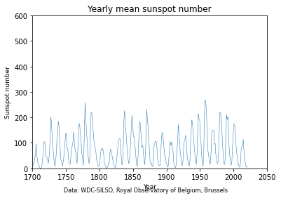
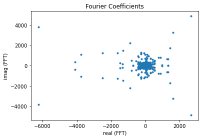
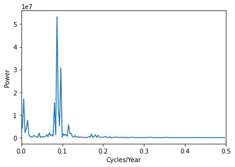
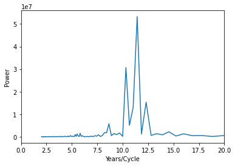
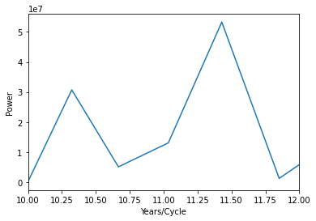

## Analysing the yearly mean sunspot activity using Fast-Fourier-Transform (FFT)

```python
# Analysing the yearly sunspot activity

import matplotlib.pyplot as plt
import pandas as pd
from scipy.fft import fft
import numpy as np
# read the data and assign column names
df = pd.read_csv('SN_y_tot_V2.0.csv', delimiter=';', header=None,
                 names=('year', 'ssn', 'sd', 'n_obs',
                        'def'))

# create numpy arrays of date and sunspot number
d_ssn = df.loc[:, 'ssn']
d_year = df.loc[:, 'year']
d_ssn = d_ssn.to_numpy()
d_year = d_year.to_numpy()


# Plot the sunspot numbers

```


```python


fig = plt.figure()
plt.plot(d_year, d_ssn, linewidth=0.5)
plt.axis([1700, 2050, 0, 600])
plt.xlabel('Year', fontsize=9)
plt.ylabel('Sunspot number', fontsize=9)
plt.title('Yearly mean sunspot number')
plt.figtext(0.5, 0.01, 'Data: WDC-SILSO, Royal Observatory of Belgium, Brussels',
            ha='center', fontsize=8)
plt.show()


```


    
<!-- -->    


```python


# use Fast Fourier Transform on sunspot numbers
sp_fft = fft(d_ssn)
# the first entry is simply the sum of the data and we delete it
print("First entry in array: ", sp_fft[0])
print("Sum of the data: ", np.sum(d_ssn))
sp_fft = np.delete(sp_fft, 0)
sp_fft[0]
sp_fft_real = sp_fft.real
sp_fft_imag = sp_fft.imag
# plot Fourier coefficients in the Complex Plane
fig = plt.figure()
plt.scatter(sp_fft_real, sp_fft_imag, marker='.')
plt.xlabel('real (FFT)')
plt.ylabel('imag (FFT)')
plt.title('Fourier Coefficients')
plt.show()


# Fourier coefficients are difficult to interpret. Squaring the magnitude of
# the coefficients is a measure of power. In the FFT array half of the
# coefficients are repeated in magnitude, so it is sufficient to calculate the
# power of one half.
# Plot the power spectrum as a function of frequency, measured in cycles per year.

```

    First entry in array:  (25203.8-0j)
    Sum of the data:  25203.800000000003


    
<!-- -->    


```python


n = len(sp_fft)
power = abs(sp_fft[0:((n + 1) // 2)])**2
nyquist = 0.5
freq = np.array(range(n // 2)) / (n // 2) * nyquist
freq = np.delete(freq, 0)
power = np.delete(power, 0)
fig = plt.figure()
plt.plot(freq, power)
plt.xlim(0, 0.5)
plt.ylabel('Power')
plt.xlabel('Cycles/Year')
plt.show()


# The frequency for the maximum sunspot activity is less than one year. Changing
# to period instead of cycles is easier to interpret.
# The plot indicates a sunspot cycle between 11 and 12 years.

```


    

<!-- -->    


```python


period = 1 / freq
fig = plt.figure()
plt.plot(period, power)
plt.xlim(0, 20)
plt.xlabel('Years/Cycle')
plt.ylabel('Power')
plt.show()


# Changing the limit of the plot, we see a cycle of about 11.4 years.

```


    
<!-- -->    


```python


period = 1 / freq
fig = plt.figure()
plt.plot(period, power)
plt.xlim(10, 12)
plt.xlabel('Years/Cycle')
plt.ylabel('Power')
plt.show()


```


<!-- -->    


```python


```

